# AVEL database: entity relationships

Generated from the Drizzle schema in `packages/db` by `pnpm --filter @avel/docs generate`.
Don't edit it by hand: change the schema and generate again. `docs/design/DATABASE.md` is
checked against the same schema by `pnpm --filter @avel/docs drift`.

92 tables and 207 foreign keys, drawn as 197 parent and child relationships.

- **Grouped by owning module** (`tableOwners` in `@avel/db`). A module's diagram draws its
  own tables with their columns, and each relationship whose child is one of them; a parent
  from another module appears there by name only.
- **Relationship marks:** `||--` at least one foreign key to the parent is required, `|o--`
  every one is optional; `--o{` a parent can have many such rows, `--o|` at most one. The
  label lists the foreign-key columns.
- **Columns:** `PK` primary key, `FK` in a foreign key, `"optional"` nullable.

| Module | Tables |
| --- | --- |
| `platform` | `auth_accounts`, `auth_passkeys`, `auth_sessions`, `auth_verifications`, `cli_sessions`, `idempotency_keys`, `jobs`, `step_up_grants`, `users`, `webhook_deliveries` |
| `events` | `agent_traces`, `consumer_cursors`, `events` |
| `audit` | `activity_log`, `overrides`, `redactions` |
| `cli` | `device_logins` |
| `onboarding` | `checkpoint_facts`, `checkpoints`, `clients`, `context_refs`, `facts`, `messages`, `onboarding_sessions`, `questions`, `readiness_waivers`, `rubric_results`, `topic_coverage`, `uploads`, `usage_log` |
| `packages` | `packages` |
| `plan` | `checks`, `codebase_analysis`, `mission_scenarios`, `module_checks`, `plan_module_deps`, `plan_modules`, `plans`, `quality_targets`, `requirements`, `scenario_modules`, `scenarios` |
| `factory` | `dispatches`, `findings`, `mission_docs`, `mission_pauses`, `mission_refreshes`, `missions`, `module_runs`, `notes`, `proposal_findings`, `proposals`, `task_docs` |
| `integrator` | `dependency_requests`, `integration_commits`, `locked_scripts`, `quarantines`, `test_locks` |
| `runner` | `attempts`, `completion_reports`, `progress_notes`, `skill_loads` |
| `compute` | `credentials`, `rooms` |
| `metering` | `budget_reservations`, `human_time`, `payments`, `price_table` |
| `gate` | `check_results`, `gate_evaluations`, `gate_runs`, `pass_approvals`, `receipts`, `release_approvals` |
| `delivery` | `deliveries`, `repo_connections`, `secrets` |
| `rules` | `rules`, `rules_version_rules`, `rules_versions` |
| `knowledge` | `closeout_items`, `design_systems`, `factory_versions`, `kb_entries`, `kb_release_entries`, `kb_releases`, `skills`, `templates` |
| `evals` | `agent_configs`, `eval_results`, `eval_runs`, `eval_tasks` |

## platform

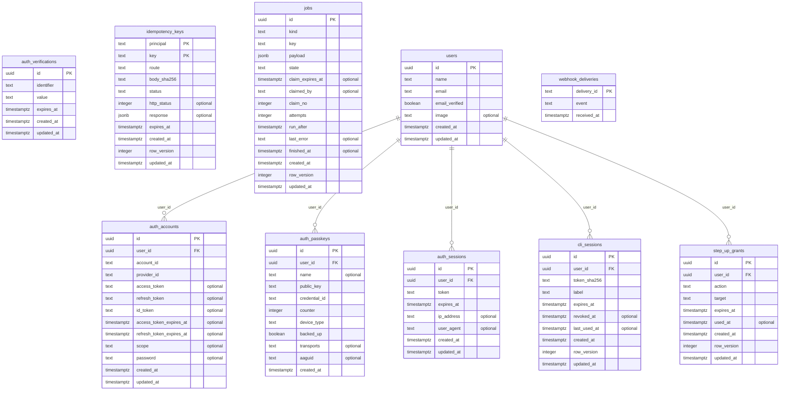
```mermaid
erDiagram
  auth_accounts {
    uuid id PK
    uuid user_id FK
    text account_id
    text provider_id
    text access_token "optional"
    text refresh_token "optional"
    text id_token "optional"
    timestamptz access_token_expires_at "optional"
    timestamptz refresh_token_expires_at "optional"
    text scope "optional"
    text password "optional"
    timestamptz created_at
    timestamptz updated_at
  }
  auth_passkeys {
    uuid id PK
    uuid user_id FK
    text name "optional"
    text public_key
    text credential_id
    integer counter
    text device_type
    boolean backed_up
    text transports "optional"
    text aaguid "optional"
    timestamptz created_at
  }
  auth_sessions {
    uuid id PK
    uuid user_id FK
    text token
    timestamptz expires_at
    text ip_address "optional"
    text user_agent "optional"
    timestamptz created_at
    timestamptz updated_at
  }
  auth_verifications {
    uuid id PK
    text identifier
    text value
    timestamptz expires_at
    timestamptz created_at
    timestamptz updated_at
  }
  cli_sessions {
    uuid id PK
    uuid user_id FK
    text token_sha256
    text label
    timestamptz expires_at
    timestamptz revoked_at "optional"
    timestamptz last_used_at "optional"
    timestamptz created_at
    integer row_version
    timestamptz updated_at
  }
  idempotency_keys {
    text principal PK
    text key PK
    text route
    text body_sha256
    text status
    integer http_status "optional"
    jsonb response "optional"
    timestamptz expires_at
    timestamptz created_at
    integer row_version
    timestamptz updated_at
  }
  jobs {
    uuid id PK
    text kind
    text key
    jsonb payload
    text state
    timestamptz claim_expires_at "optional"
    text claimed_by "optional"
    integer claim_no
    integer attempts
    timestamptz run_after
    text last_error "optional"
    timestamptz finished_at "optional"
    timestamptz created_at
    integer row_version
    timestamptz updated_at
  }
  step_up_grants {
    uuid id PK
    uuid user_id FK
    text action
    text target
    timestamptz expires_at
    timestamptz used_at "optional"
    timestamptz created_at
    integer row_version
    timestamptz updated_at
  }
  users {
    uuid id PK
    text name
    text email
    boolean email_verified
    text image "optional"
    timestamptz created_at
    timestamptz updated_at
  }
  webhook_deliveries {
    text delivery_id PK
    text event
    timestamptz received_at
  }
  users ||--o{ auth_accounts : "user_id"
  users ||--o{ auth_passkeys : "user_id"
  users ||--o{ auth_sessions : "user_id"
  users ||--o{ cli_sessions : "user_id"
  users ||--o{ step_up_grants : "user_id"
```

## events

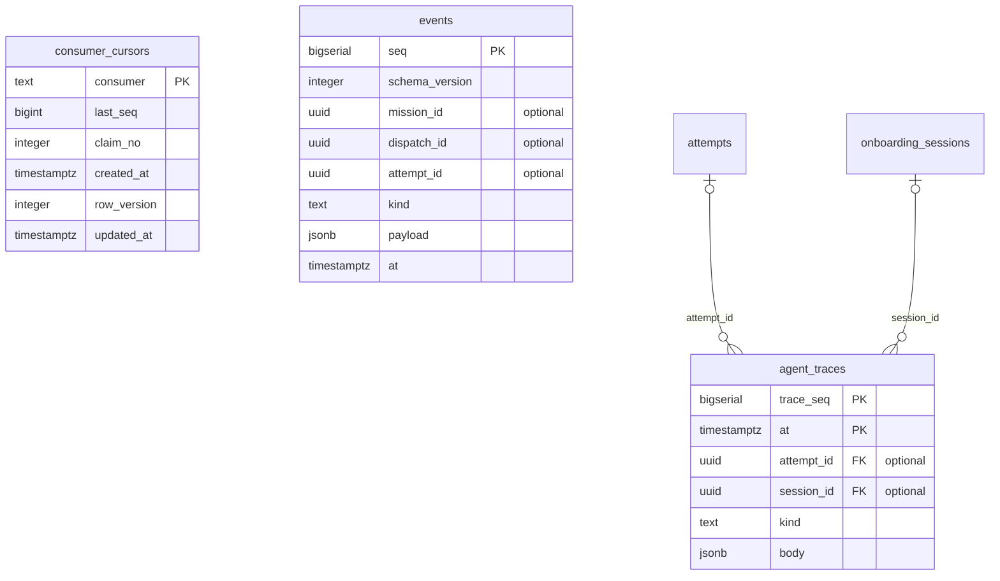
```mermaid
erDiagram
  agent_traces {
    bigserial trace_seq PK
    timestamptz at PK
    uuid attempt_id FK "optional"
    uuid session_id FK "optional"
    text kind
    jsonb body
  }
  consumer_cursors {
    text consumer PK
    bigint last_seq
    integer claim_no
    timestamptz created_at
    integer row_version
    timestamptz updated_at
  }
  events {
    bigserial seq PK
    integer schema_version
    uuid mission_id "optional"
    uuid dispatch_id "optional"
    uuid attempt_id "optional"
    text kind
    jsonb payload
    timestamptz at
  }
  attempts |o--o{ agent_traces : "attempt_id"
  onboarding_sessions |o--o{ agent_traces : "session_id"
```

## audit

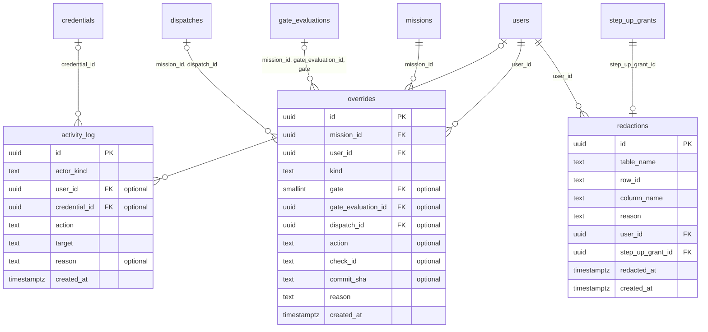
```mermaid
erDiagram
  activity_log {
    uuid id PK
    text actor_kind
    uuid user_id FK "optional"
    uuid credential_id FK "optional"
    text action
    text target
    text reason "optional"
    timestamptz created_at
  }
  overrides {
    uuid id PK
    uuid mission_id FK
    uuid user_id FK
    text kind
    smallint gate FK "optional"
    uuid gate_evaluation_id FK "optional"
    uuid dispatch_id FK "optional"
    text action "optional"
    text check_id "optional"
    text commit_sha "optional"
    text reason
    timestamptz created_at
  }
  redactions {
    uuid id PK
    text table_name
    text row_id
    text column_name
    text reason
    uuid user_id FK
    uuid step_up_grant_id FK
    timestamptz redacted_at
    timestamptz created_at
  }
  credentials |o--o{ activity_log : "credential_id"
  dispatches |o--o{ overrides : "mission_id, dispatch_id"
  gate_evaluations |o--o{ overrides : "mission_id, gate_evaluation_id, gate"
  missions ||--o{ overrides : "mission_id"
  step_up_grants ||--o| redactions : "step_up_grant_id"
  users |o--o{ activity_log : "user_id"
  users ||--o{ overrides : "user_id"
  users ||--o{ redactions : "user_id"
```

## cli

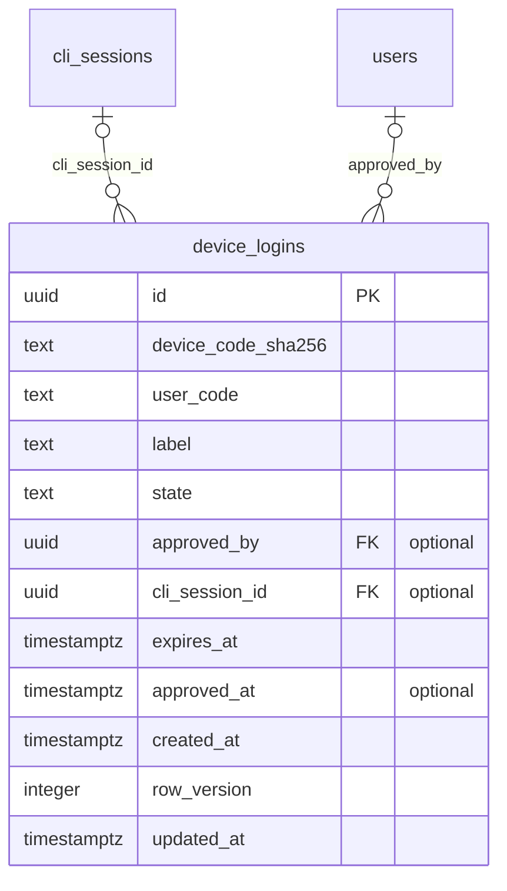
```mermaid
erDiagram
  device_logins {
    uuid id PK
    text device_code_sha256
    text user_code
    text label
    text state
    uuid approved_by FK "optional"
    uuid cli_session_id FK "optional"
    timestamptz expires_at
    timestamptz approved_at "optional"
    timestamptz created_at
    integer row_version
    timestamptz updated_at
  }
  cli_sessions |o--o{ device_logins : "cli_session_id"
  users |o--o{ device_logins : "approved_by"
```

## onboarding

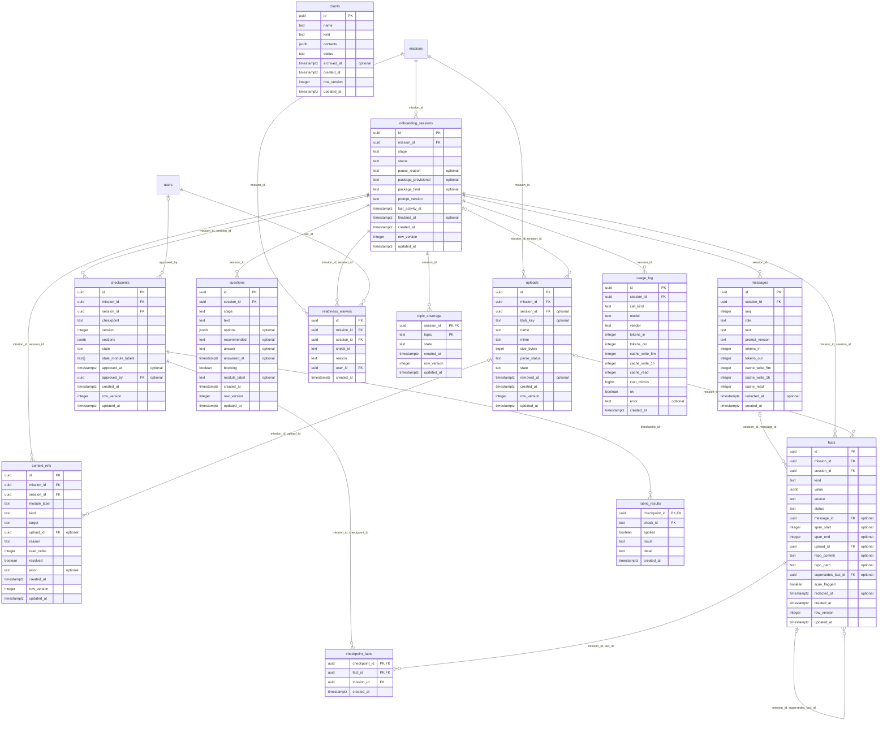
```mermaid
erDiagram
  checkpoint_facts {
    uuid checkpoint_id PK, FK
    uuid fact_id PK, FK
    uuid mission_id FK
    timestamptz created_at
  }
  checkpoints {
    uuid id PK
    uuid mission_id FK
    uuid session_id FK
    text checkpoint
    integer version
    jsonb sections
    text state
    text[] stale_module_labels
    timestamptz approved_at "optional"
    uuid approved_by FK "optional"
    timestamptz created_at
    integer row_version
    timestamptz updated_at
  }
  clients {
    uuid id PK
    text name
    text kind
    jsonb contacts
    text status
    timestamptz archived_at "optional"
    timestamptz created_at
    integer row_version
    timestamptz updated_at
  }
  context_refs {
    uuid id PK
    uuid mission_id FK
    uuid session_id FK
    text module_label
    text kind
    text target
    uuid upload_id FK "optional"
    text reason
    integer read_order
    boolean resolved
    text error "optional"
    timestamptz created_at
    integer row_version
    timestamptz updated_at
  }
  facts {
    uuid id PK
    uuid mission_id FK
    uuid session_id FK
    text kind
    jsonb value
    text source
    text status
    uuid message_id FK "optional"
    integer span_start "optional"
    integer span_end "optional"
    uuid upload_id FK "optional"
    text repo_commit "optional"
    text repo_path "optional"
    uuid supersedes_fact_id FK "optional"
    boolean scan_flagged
    timestamptz redacted_at "optional"
    timestamptz created_at
    integer row_version
    timestamptz updated_at
  }
  messages {
    uuid id PK
    uuid session_id FK
    integer seq
    text role
    text text
    text prompt_version
    integer tokens_in
    integer tokens_out
    integer cache_write_5m
    integer cache_write_1h
    integer cache_read
    timestamptz redacted_at "optional"
    timestamptz created_at
  }
  onboarding_sessions {
    uuid id PK
    uuid mission_id FK
    text stage
    text status
    text pause_reason "optional"
    text package_provisional "optional"
    text package_final "optional"
    text prompt_version
    timestamptz last_activity_at
    timestamptz finalized_at "optional"
    timestamptz created_at
    integer row_version
    timestamptz updated_at
  }
  questions {
    uuid id PK
    uuid session_id FK
    text stage
    text text
    jsonb options "optional"
    text recommended "optional"
    text answer "optional"
    timestamptz answered_at "optional"
    boolean blocking
    text module_label "optional"
    timestamptz created_at
    integer row_version
    timestamptz updated_at
  }
  readiness_waivers {
    uuid id PK
    uuid mission_id FK
    uuid session_id FK
    text check_id
    text reason
    uuid user_id FK
    timestamptz created_at
  }
  rubric_results {
    uuid checkpoint_id PK, FK
    text check_id PK
    boolean applies
    text result
    text detail
    timestamptz created_at
  }
  topic_coverage {
    uuid session_id PK, FK
    text topic PK
    text state
    timestamptz created_at
    integer row_version
    timestamptz updated_at
  }
  uploads {
    uuid id PK
    uuid mission_id FK
    uuid session_id FK "optional"
    text blob_key "optional"
    text name
    text mime
    bigint size_bytes
    text parse_status
    text state
    timestamptz removed_at "optional"
    timestamptz created_at
    integer row_version
    timestamptz updated_at
  }
  usage_log {
    uuid id PK
    uuid session_id FK
    text call_kind
    text model
    text vendor
    integer tokens_in
    integer tokens_out
    integer cache_write_5m
    integer cache_write_1h
    integer cache_read
    bigint cost_micros
    boolean ok
    text error "optional"
    timestamptz created_at
  }
  checkpoints ||--o{ checkpoint_facts : "mission_id, checkpoint_id"
  checkpoints ||--o{ rubric_results : "checkpoint_id"
  facts ||--o{ checkpoint_facts : "mission_id, fact_id"
  facts |o--o{ facts : "mission_id, supersedes_fact_id"
  messages |o--o{ facts : "session_id, message_id"
  missions ||--o{ onboarding_sessions : "mission_id"
  missions ||--o{ readiness_waivers : "mission_id"
  missions ||--o{ uploads : "mission_id"
  onboarding_sessions ||--o{ checkpoints : "mission_id, session_id"
  onboarding_sessions ||--o{ context_refs : "mission_id, session_id"
  onboarding_sessions ||--o{ facts : "mission_id, session_id"
  onboarding_sessions ||--o{ messages : "session_id"
  onboarding_sessions ||--o{ questions : "session_id"
  onboarding_sessions ||--o{ readiness_waivers : "mission_id, session_id"
  onboarding_sessions ||--o{ topic_coverage : "session_id"
  onboarding_sessions |o--o{ uploads : "mission_id, session_id"
  onboarding_sessions ||--o{ usage_log : "session_id"
  uploads |o--o{ context_refs : "mission_id, upload_id"
  uploads |o--o{ facts : "mission_id, upload_id"
  users |o--o{ checkpoints : "approved_by"
  users ||--o{ readiness_waivers : "user_id"
```

## packages

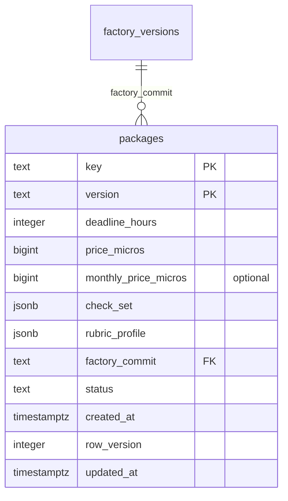
```mermaid
erDiagram
  packages {
    text key PK
    text version PK
    integer deadline_hours
    bigint price_micros
    bigint monthly_price_micros "optional"
    jsonb check_set
    jsonb rubric_profile
    text factory_commit FK
    text status
    timestamptz created_at
    integer row_version
    timestamptz updated_at
  }
  factory_versions ||--o{ packages : "factory_commit"
```

## plan

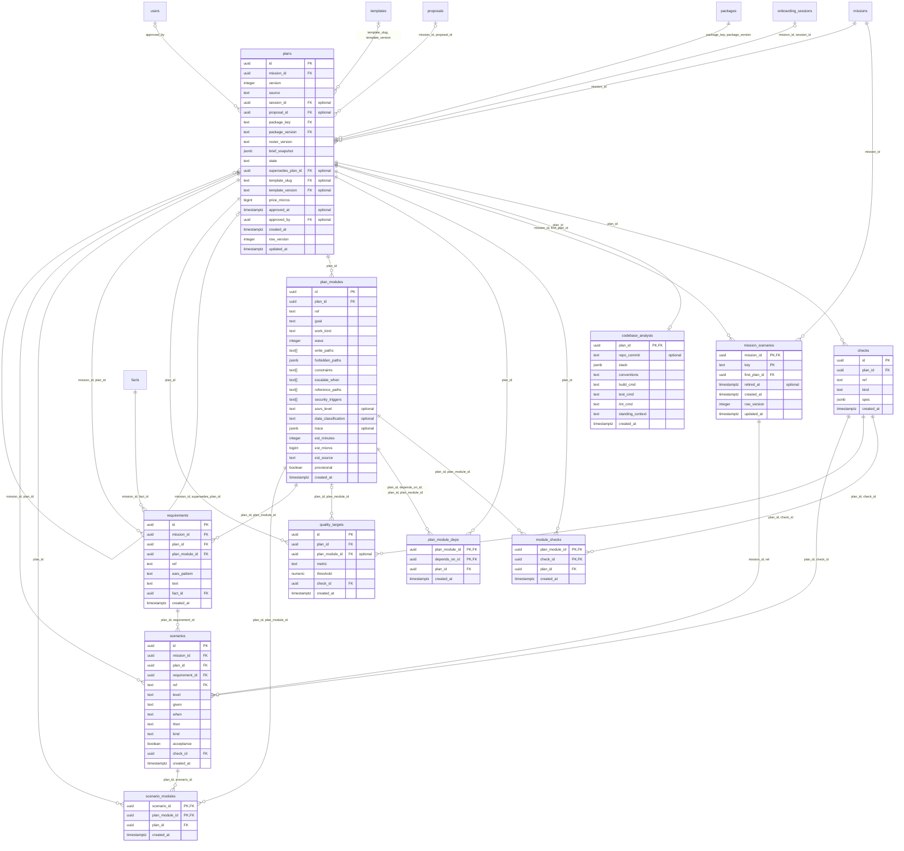
```mermaid
erDiagram
  checks {
    uuid id PK
    uuid plan_id FK
    text ref
    text kind
    jsonb spec
    timestamptz created_at
  }
  codebase_analysis {
    uuid plan_id PK, FK
    text repo_commit "optional"
    jsonb stack
    text conventions
    text build_cmd
    text test_cmd
    text lint_cmd
    text standing_context
    timestamptz created_at
  }
  mission_scenarios {
    uuid mission_id PK, FK
    text key PK
    uuid first_plan_id FK
    timestamptz retired_at "optional"
    timestamptz created_at
    integer row_version
    timestamptz updated_at
  }
  module_checks {
    uuid plan_module_id PK, FK
    uuid check_id PK, FK
    uuid plan_id FK
    timestamptz created_at
  }
  plan_module_deps {
    uuid plan_module_id PK, FK
    uuid depends_on_id PK, FK
    uuid plan_id FK
    timestamptz created_at
  }
  plan_modules {
    uuid id PK
    uuid plan_id FK
    text ref
    text goal
    text work_kind
    integer wave
    text[] write_paths
    jsonb forbidden_paths
    text[] constraints
    text[] escalate_when
    text[] reference_paths
    text[] security_triggers
    text asvs_level "optional"
    text data_classification "optional"
    jsonb trace "optional"
    integer est_minutes
    bigint est_micros
    text est_source
    boolean provisional
    timestamptz created_at
  }
  plans {
    uuid id PK
    uuid mission_id FK
    integer version
    text source
    uuid session_id FK "optional"
    uuid proposal_id FK "optional"
    text package_key FK
    text package_version FK
    text roster_version
    jsonb brief_snapshot
    text state
    uuid supersedes_plan_id FK "optional"
    text template_slug FK "optional"
    text template_version FK "optional"
    bigint price_micros
    timestamptz approved_at "optional"
    uuid approved_by FK "optional"
    timestamptz created_at
    integer row_version
    timestamptz updated_at
  }
  quality_targets {
    uuid id PK
    uuid plan_id FK
    uuid plan_module_id FK "optional"
    text metric
    numeric threshold
    uuid check_id FK
    timestamptz created_at
  }
  requirements {
    uuid id PK
    uuid mission_id FK
    uuid plan_id FK
    uuid plan_module_id FK
    text ref
    text ears_pattern
    text text
    uuid fact_id FK
    timestamptz created_at
  }
  scenario_modules {
    uuid scenario_id PK, FK
    uuid plan_module_id PK, FK
    uuid plan_id FK
    timestamptz created_at
  }
  scenarios {
    uuid id PK
    uuid mission_id FK
    uuid plan_id FK
    uuid requirement_id FK
    text ref FK
    text level
    text given
    text when
    text then
    text kind
    boolean acceptance
    uuid check_id FK
    timestamptz created_at
  }
  checks ||--o{ module_checks : "plan_id, check_id"
  checks ||--o{ quality_targets : "plan_id, check_id"
  checks ||--o{ scenarios : "plan_id, check_id"
  facts ||--o{ requirements : "mission_id, fact_id"
  mission_scenarios ||--o{ scenarios : "mission_id, ref"
  missions ||--o{ mission_scenarios : "mission_id"
  missions ||--o{ plans : "mission_id"
  onboarding_sessions |o--o{ plans : "mission_id, session_id"
  packages ||--o{ plans : "package_key, package_version"
  plan_modules ||--o{ module_checks : "plan_id, plan_module_id"
  plan_modules ||--o{ plan_module_deps : "plan_id, depends_on_id; plan_id, plan_module_id"
  plan_modules |o--o{ quality_targets : "plan_id, plan_module_id"
  plan_modules ||--o{ requirements : "plan_id, plan_module_id"
  plan_modules ||--o{ scenario_modules : "plan_id, plan_module_id"
  plans ||--o{ checks : "plan_id"
  plans ||--o| codebase_analysis : "plan_id"
  plans ||--o{ mission_scenarios : "mission_id, first_plan_id"
  plans ||--o{ module_checks : "plan_id"
  plans ||--o{ plan_module_deps : "plan_id"
  plans ||--o{ plan_modules : "plan_id"
  plans |o--o{ plans : "mission_id, supersedes_plan_id"
  plans ||--o{ quality_targets : "plan_id"
  plans ||--o{ requirements : "mission_id, plan_id"
  plans ||--o{ scenario_modules : "plan_id"
  plans ||--o{ scenarios : "mission_id, plan_id"
  proposals |o--o{ plans : "mission_id, proposal_id"
  requirements ||--o{ scenarios : "plan_id, requirement_id"
  scenarios ||--o{ scenario_modules : "plan_id, scenario_id"
  templates |o--o{ plans : "template_slug, template_version"
  users |o--o{ plans : "approved_by"
```

## factory

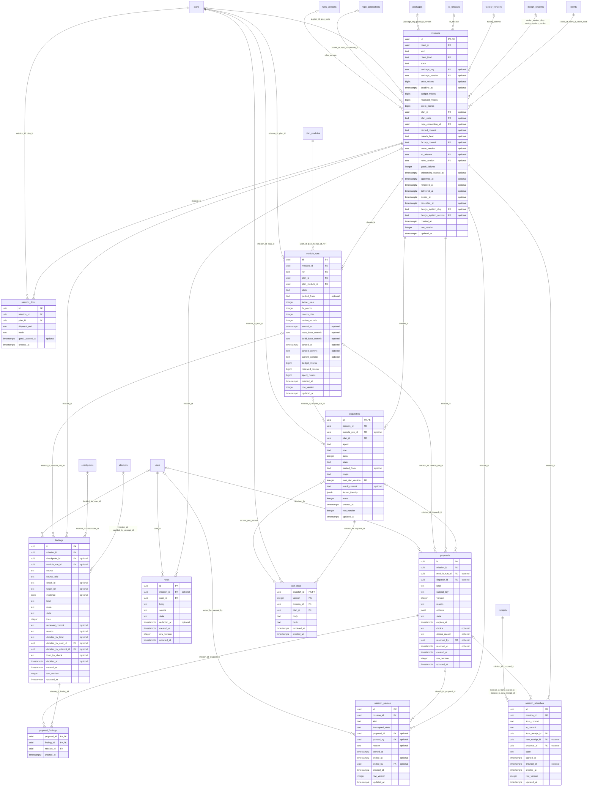
```mermaid
erDiagram
  dispatches {
    uuid id PK, FK
    uuid mission_id FK
    uuid module_run_id FK "optional"
    uuid plan_id FK
    text agent
    text role
    integer pass
    text state
    text parked_from "optional"
    text origin
    integer task_doc_version FK
    text result_commit "optional"
    jsonb frozen_identity
    integer wave
    timestamptz created_at
    integer row_version
    timestamptz updated_at
  }
  findings {
    uuid id PK
    uuid mission_id FK
    uuid checkpoint_id FK "optional"
    uuid module_run_id FK "optional"
    text source
    text source_role
    text check_id "optional"
    text target_ref "optional"
    jsonb evidence "optional"
    text kind
    text route
    text state
    integer tries
    text reviewed_commit "optional"
    text reason "optional"
    text decided_by_kind "optional"
    uuid decided_by_user_id FK "optional"
    uuid decided_by_attempt_id FK "optional"
    text fixed_by_check "optional"
    timestamptz decided_at "optional"
    timestamptz created_at
    integer row_version
    timestamptz updated_at
  }
  mission_docs {
    uuid id PK
    uuid mission_id FK
    uuid plan_id FK
    text dispatch_md
    text hash
    timestamptz gate1_passed_at "optional"
    timestamptz created_at
  }
  mission_pauses {
    uuid id PK
    uuid mission_id FK
    text kind
    text interrupted_state
    uuid proposal_id FK "optional"
    uuid paused_by FK "optional"
    text reason "optional"
    timestamptz started_at
    timestamptz ended_at "optional"
    uuid ended_by FK "optional"
    timestamptz created_at
    integer row_version
    timestamptz updated_at
  }
  mission_refreshes {
    uuid id PK
    uuid mission_id FK
    text from_commit
    text to_commit
    uuid from_receipt_id FK
    uuid new_receipt_id FK "optional"
    uuid proposal_id FK "optional"
    text state
    timestamptz started_at
    timestamptz finished_at "optional"
    timestamptz created_at
    integer row_version
    timestamptz updated_at
  }
  missions {
    uuid id PK, FK
    uuid client_id FK
    text kind
    text client_kind FK
    text state
    text package_key FK "optional"
    text package_version FK "optional"
    bigint price_micros "optional"
    timestamptz deadline_at "optional"
    bigint budget_micros
    bigint reserved_micros
    bigint spent_micros
    uuid plan_id FK "optional"
    text plan_state FK "optional"
    uuid repo_connection_id FK "optional"
    text pinned_commit "optional"
    text branch_head "optional"
    text factory_commit FK "optional"
    text roster_version "optional"
    text kb_release FK "optional"
    text rules_version FK "optional"
    integer gate5_failures
    timestamptz onboarding_started_at "optional"
    timestamptz approved_at "optional"
    timestamptz rendered_at "optional"
    timestamptz delivered_at "optional"
    timestamptz closed_at "optional"
    timestamptz cancelled_at "optional"
    text design_system_slug FK "optional"
    text design_system_version FK "optional"
    timestamptz created_at
    integer row_version
    timestamptz updated_at
  }
  module_runs {
    uuid id PK
    uuid mission_id FK
    text ref FK
    uuid plan_id FK
    uuid plan_module_id FK
    text state
    text parked_from "optional"
    integer ladder_step
    integer fix_rounds
    integer rework_tries
    integer review_rounds
    timestamptz started_at "optional"
    text tests_base_commit "optional"
    text build_base_commit "optional"
    timestamptz landed_at "optional"
    text landed_commit "optional"
    text current_commit "optional"
    bigint budget_micros
    bigint reserved_micros
    bigint spent_micros
    timestamptz created_at
    integer row_version
    timestamptz updated_at
  }
  notes {
    uuid id PK
    uuid mission_id FK "optional"
    uuid user_id FK
    text body
    text source
    text state
    timestamptz redacted_at "optional"
    timestamptz created_at
    integer row_version
    timestamptz updated_at
  }
  proposal_findings {
    uuid proposal_id PK, FK
    uuid finding_id PK, FK
    uuid mission_id FK
    timestamptz created_at
  }
  proposals {
    uuid id PK
    uuid mission_id FK
    uuid module_run_id FK "optional"
    uuid dispatch_id FK "optional"
    text kind
    text subject_key
    integer version
    text reason
    jsonb options
    text state
    timestamptz expires_at
    text choice "optional"
    text choice_reason "optional"
    uuid resolved_by FK "optional"
    timestamptz resolved_at "optional"
    timestamptz created_at
    integer row_version
    timestamptz updated_at
  }
  task_docs {
    uuid dispatch_id PK, FK
    integer version PK
    uuid mission_id FK
    uuid plan_id FK
    text body
    text hash
    timestamptz rendered_at
    timestamptz created_at
  }
  attempts |o--o{ findings : "mission_id, decided_by_attempt_id"
  checkpoints |o--o{ findings : "mission_id, checkpoint_id"
  clients ||--o{ missions : "client_id; client_id, client_kind"
  design_systems |o--o{ missions : "design_system_slug, design_system_version"
  dispatches |o--o{ proposals : "mission_id, dispatch_id"
  dispatches ||--o{ task_docs : "mission_id, dispatch_id"
  factory_versions |o--o{ missions : "factory_commit"
  findings ||--o{ proposal_findings : "mission_id, finding_id"
  kb_releases |o--o{ missions : "kb_release"
  missions ||--o{ dispatches : "mission_id"
  missions ||--o{ findings : "mission_id"
  missions ||--o{ mission_docs : "mission_id"
  missions ||--o{ mission_pauses : "mission_id"
  missions ||--o{ mission_refreshes : "mission_id"
  missions ||--o{ module_runs : "mission_id"
  missions |o--o{ notes : "mission_id"
  missions ||--o{ proposals : "mission_id"
  module_runs |o--o{ dispatches : "mission_id, module_run_id"
  module_runs |o--o{ findings : "mission_id, module_run_id"
  module_runs |o--o{ proposals : "mission_id, module_run_id"
  packages |o--o{ missions : "package_key, package_version"
  plan_modules ||--o{ module_runs : "plan_id, plan_module_id, ref"
  plans ||--o{ dispatches : "mission_id, plan_id"
  plans ||--o{ mission_docs : "mission_id, plan_id"
  plans |o--o{ missions : "id, plan_id, plan_state"
  plans ||--o{ module_runs : "mission_id, plan_id"
  plans ||--o{ task_docs : "mission_id, plan_id"
  proposals |o--o{ mission_pauses : "mission_id, proposal_id"
  proposals |o--o{ mission_refreshes : "mission_id, proposal_id"
  proposals ||--o{ proposal_findings : "mission_id, proposal_id"
  receipts ||--o{ mission_refreshes : "mission_id, from_receipt_id; mission_id, new_receipt_id"
  repo_connections |o--o{ missions : "client_id, repo_connection_id"
  rules_versions |o--o{ missions : "rules_version"
  task_docs ||--o{ dispatches : "id, task_doc_version"
  users |o--o{ findings : "decided_by_user_id"
  users |o--o{ mission_pauses : "ended_by; paused_by"
  users ||--o{ notes : "user_id"
  users |o--o{ proposals : "resolved_by"
```

## integrator

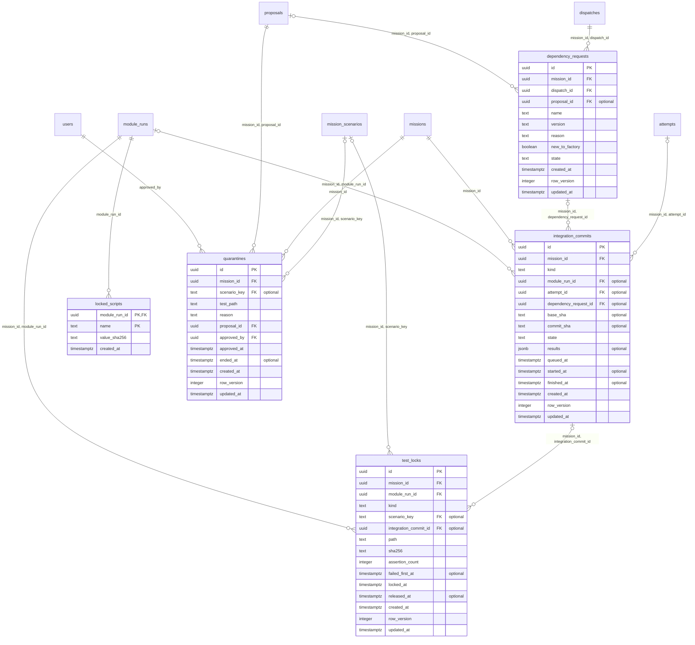
```mermaid
erDiagram
  dependency_requests {
    uuid id PK
    uuid mission_id FK
    uuid dispatch_id FK
    uuid proposal_id FK "optional"
    text name
    text version
    text reason
    boolean new_to_factory
    text state
    timestamptz created_at
    integer row_version
    timestamptz updated_at
  }
  integration_commits {
    uuid id PK
    uuid mission_id FK
    text kind
    uuid module_run_id FK "optional"
    uuid attempt_id FK "optional"
    uuid dependency_request_id FK "optional"
    text base_sha "optional"
    text commit_sha "optional"
    text state
    jsonb results "optional"
    timestamptz queued_at
    timestamptz started_at "optional"
    timestamptz finished_at "optional"
    timestamptz created_at
    integer row_version
    timestamptz updated_at
  }
  locked_scripts {
    uuid module_run_id PK, FK
    text name PK
    text value_sha256
    timestamptz created_at
  }
  quarantines {
    uuid id PK
    uuid mission_id FK
    text scenario_key FK "optional"
    text test_path
    text reason
    uuid proposal_id FK
    uuid approved_by FK
    timestamptz approved_at
    timestamptz ended_at "optional"
    timestamptz created_at
    integer row_version
    timestamptz updated_at
  }
  test_locks {
    uuid id PK
    uuid mission_id FK
    uuid module_run_id FK
    text kind
    text scenario_key FK "optional"
    uuid integration_commit_id FK "optional"
    text path
    text sha256
    integer assertion_count
    timestamptz failed_first_at "optional"
    timestamptz locked_at
    timestamptz released_at "optional"
    timestamptz created_at
    integer row_version
    timestamptz updated_at
  }
  attempts |o--o{ integration_commits : "mission_id, attempt_id"
  dependency_requests |o--o{ integration_commits : "mission_id, dependency_request_id"
  dispatches ||--o{ dependency_requests : "mission_id, dispatch_id"
  integration_commits |o--o{ test_locks : "mission_id, integration_commit_id"
  mission_scenarios |o--o{ quarantines : "mission_id, scenario_key"
  mission_scenarios |o--o{ test_locks : "mission_id, scenario_key"
  missions ||--o{ integration_commits : "mission_id"
  missions ||--o{ quarantines : "mission_id"
  module_runs |o--o{ integration_commits : "mission_id, module_run_id"
  module_runs ||--o{ locked_scripts : "module_run_id"
  module_runs ||--o{ test_locks : "mission_id, module_run_id"
  proposals |o--o{ dependency_requests : "mission_id, proposal_id"
  proposals ||--o{ quarantines : "mission_id, proposal_id"
  users ||--o{ quarantines : "approved_by"
```

## runner

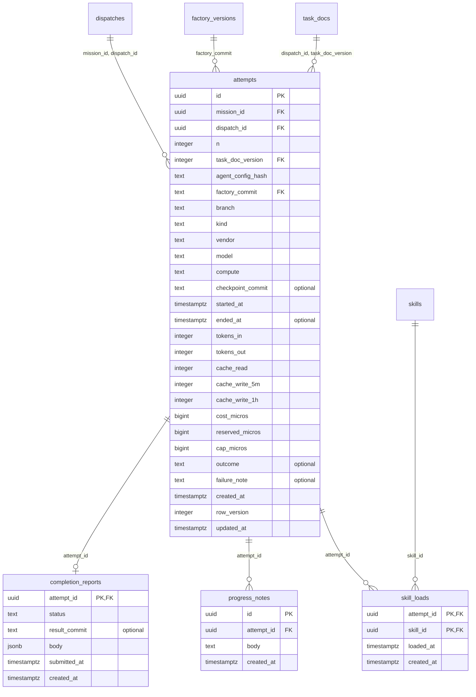
```mermaid
erDiagram
  attempts {
    uuid id PK
    uuid mission_id FK
    uuid dispatch_id FK
    integer n
    integer task_doc_version FK
    text agent_config_hash
    text factory_commit FK
    text branch
    text kind
    text vendor
    text model
    text compute
    text checkpoint_commit "optional"
    timestamptz started_at
    timestamptz ended_at "optional"
    integer tokens_in
    integer tokens_out
    integer cache_read
    integer cache_write_5m
    integer cache_write_1h
    bigint cost_micros
    bigint reserved_micros
    bigint cap_micros
    text outcome "optional"
    text failure_note "optional"
    timestamptz created_at
    integer row_version
    timestamptz updated_at
  }
  completion_reports {
    uuid attempt_id PK, FK
    text status
    text result_commit "optional"
    jsonb body
    timestamptz submitted_at
    timestamptz created_at
  }
  progress_notes {
    uuid id PK
    uuid attempt_id FK
    text body
    timestamptz created_at
  }
  skill_loads {
    uuid attempt_id PK, FK
    uuid skill_id PK, FK
    timestamptz loaded_at
    timestamptz created_at
  }
  attempts ||--o| completion_reports : "attempt_id"
  attempts ||--o{ progress_notes : "attempt_id"
  attempts ||--o{ skill_loads : "attempt_id"
  dispatches ||--o{ attempts : "mission_id, dispatch_id"
  factory_versions ||--o{ attempts : "factory_commit"
  skills ||--o{ skill_loads : "skill_id"
  task_docs ||--o{ attempts : "dispatch_id, task_doc_version"
```

## compute

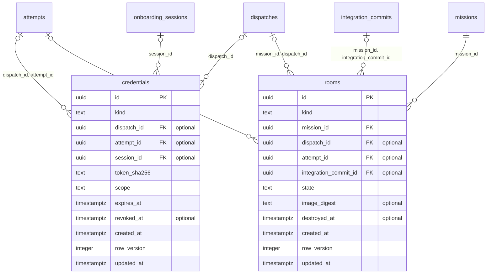
```mermaid
erDiagram
  credentials {
    uuid id PK
    text kind
    uuid dispatch_id FK "optional"
    uuid attempt_id FK "optional"
    uuid session_id FK "optional"
    text token_sha256
    text scope
    timestamptz expires_at
    timestamptz revoked_at "optional"
    timestamptz created_at
    integer row_version
    timestamptz updated_at
  }
  rooms {
    uuid id PK
    text kind
    uuid mission_id FK
    uuid dispatch_id FK "optional"
    uuid attempt_id FK "optional"
    uuid integration_commit_id FK "optional"
    text state
    text image_digest "optional"
    timestamptz destroyed_at "optional"
    timestamptz created_at
    integer row_version
    timestamptz updated_at
  }
  attempts |o--o{ credentials : "dispatch_id, attempt_id"
  attempts |o--o{ rooms : "dispatch_id, attempt_id"
  dispatches |o--o{ credentials : "dispatch_id"
  dispatches |o--o{ rooms : "mission_id, dispatch_id"
  integration_commits |o--o{ rooms : "mission_id, integration_commit_id"
  missions ||--o{ rooms : "mission_id"
  onboarding_sessions |o--o{ credentials : "session_id"
```

## metering

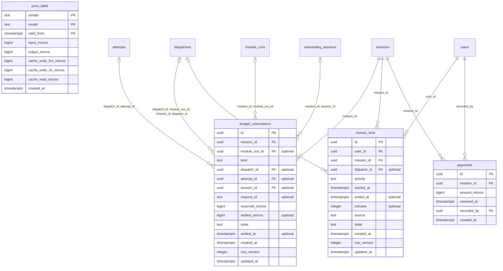
```mermaid
erDiagram
  budget_reservations {
    uuid id PK
    uuid mission_id FK
    uuid module_run_id FK "optional"
    text kind
    uuid dispatch_id FK "optional"
    uuid attempt_id FK "optional"
    uuid session_id FK "optional"
    text request_id "optional"
    bigint reserved_micros
    bigint settled_micros "optional"
    text state
    timestamptz settled_at "optional"
    timestamptz created_at
    integer row_version
    timestamptz updated_at
  }
  human_time {
    uuid id PK
    uuid user_id FK
    uuid mission_id FK
    uuid dispatch_id FK "optional"
    text activity
    timestamptz started_at
    timestamptz ended_at "optional"
    integer minutes "optional"
    text source
    text state
    timestamptz created_at
    integer row_version
    timestamptz updated_at
  }
  payments {
    uuid id PK
    uuid mission_id FK
    bigint amount_micros
    timestamptz received_at
    uuid recorded_by FK
    timestamptz created_at
  }
  price_table {
    text vendor PK
    text model PK
    timestamptz valid_from PK
    bigint input_micros
    bigint output_micros
    bigint cache_write_5m_micros
    bigint cache_write_1h_micros
    bigint cache_read_micros
    timestamptz created_at
  }
  attempts |o--o{ budget_reservations : "dispatch_id, attempt_id"
  dispatches |o--o{ budget_reservations : "dispatch_id, module_run_id; mission_id, dispatch_id"
  dispatches |o--o{ human_time : "mission_id, dispatch_id"
  missions ||--o{ budget_reservations : "mission_id"
  missions ||--o{ human_time : "mission_id"
  missions ||--o{ payments : "mission_id"
  module_runs |o--o{ budget_reservations : "mission_id, module_run_id"
  onboarding_sessions |o--o{ budget_reservations : "mission_id, session_id"
  users ||--o{ human_time : "user_id"
  users ||--o{ payments : "recorded_by"
```

## gate

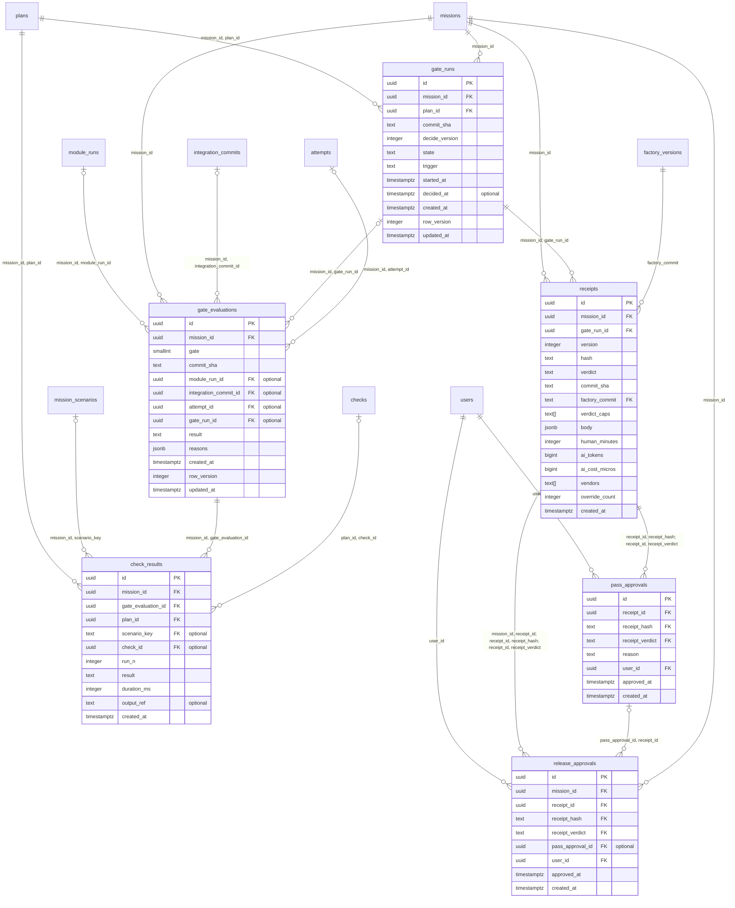
```mermaid
erDiagram
  check_results {
    uuid id PK
    uuid mission_id FK
    uuid gate_evaluation_id FK
    uuid plan_id FK
    text scenario_key FK "optional"
    uuid check_id FK "optional"
    integer run_n
    text result
    integer duration_ms
    text output_ref "optional"
    timestamptz created_at
  }
  gate_evaluations {
    uuid id PK
    uuid mission_id FK
    smallint gate
    text commit_sha
    uuid module_run_id FK "optional"
    uuid integration_commit_id FK "optional"
    uuid attempt_id FK "optional"
    uuid gate_run_id FK "optional"
    text result
    jsonb reasons
    timestamptz created_at
    integer row_version
    timestamptz updated_at
  }
  gate_runs {
    uuid id PK
    uuid mission_id FK
    uuid plan_id FK
    text commit_sha
    integer decide_version
    text state
    text trigger
    timestamptz started_at
    timestamptz decided_at "optional"
    timestamptz created_at
    integer row_version
    timestamptz updated_at
  }
  pass_approvals {
    uuid id PK
    uuid receipt_id FK
    text receipt_hash FK
    text receipt_verdict FK
    text reason
    uuid user_id FK
    timestamptz approved_at
    timestamptz created_at
  }
  receipts {
    uuid id PK
    uuid mission_id FK
    uuid gate_run_id FK
    integer version
    text hash
    text verdict
    text commit_sha
    text factory_commit FK
    text[] verdict_caps
    jsonb body
    integer human_minutes
    bigint ai_tokens
    bigint ai_cost_micros
    text[] vendors
    integer override_count
    timestamptz created_at
  }
  release_approvals {
    uuid id PK
    uuid mission_id FK
    uuid receipt_id FK
    text receipt_hash FK
    text receipt_verdict FK
    uuid pass_approval_id FK "optional"
    uuid user_id FK
    timestamptz approved_at
    timestamptz created_at
  }
  attempts |o--o{ gate_evaluations : "mission_id, attempt_id"
  checks |o--o{ check_results : "plan_id, check_id"
  factory_versions ||--o{ receipts : "factory_commit"
  gate_evaluations ||--o{ check_results : "mission_id, gate_evaluation_id"
  gate_runs |o--o{ gate_evaluations : "mission_id, gate_run_id"
  gate_runs ||--o{ receipts : "mission_id, gate_run_id"
  integration_commits |o--o{ gate_evaluations : "mission_id, integration_commit_id"
  mission_scenarios |o--o{ check_results : "mission_id, scenario_key"
  missions ||--o{ gate_evaluations : "mission_id"
  missions ||--o{ gate_runs : "mission_id"
  missions ||--o{ receipts : "mission_id"
  missions ||--o{ release_approvals : "mission_id"
  module_runs |o--o{ gate_evaluations : "mission_id, module_run_id"
  pass_approvals |o--o{ release_approvals : "pass_approval_id, receipt_id"
  plans ||--o{ check_results : "mission_id, plan_id"
  plans ||--o{ gate_runs : "mission_id, plan_id"
  receipts ||--o{ pass_approvals : "receipt_id, receipt_hash; receipt_id, receipt_verdict"
  receipts ||--o{ release_approvals : "mission_id, receipt_id; receipt_id, receipt_hash; receipt_id, receipt_verdict"
  users ||--o{ pass_approvals : "user_id"
  users ||--o{ release_approvals : "user_id"
```

## delivery

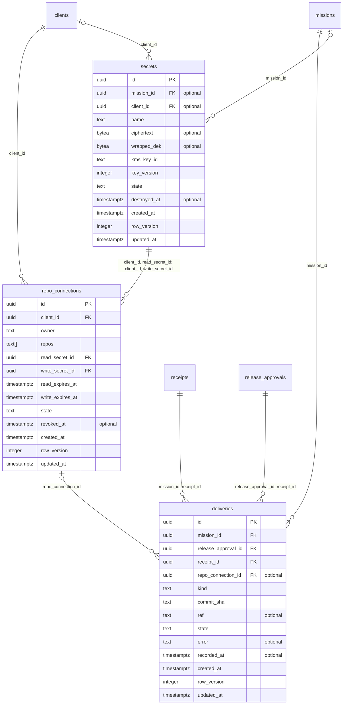
```mermaid
erDiagram
  deliveries {
    uuid id PK
    uuid mission_id FK
    uuid release_approval_id FK
    uuid receipt_id FK
    uuid repo_connection_id FK "optional"
    text kind
    text commit_sha
    text ref "optional"
    text state
    text error "optional"
    timestamptz recorded_at "optional"
    timestamptz created_at
    integer row_version
    timestamptz updated_at
  }
  repo_connections {
    uuid id PK
    uuid client_id FK
    text owner
    text[] repos
    uuid read_secret_id FK
    uuid write_secret_id FK
    timestamptz read_expires_at
    timestamptz write_expires_at
    text state
    timestamptz revoked_at "optional"
    timestamptz created_at
    integer row_version
    timestamptz updated_at
  }
  secrets {
    uuid id PK
    uuid mission_id FK "optional"
    uuid client_id FK "optional"
    text name
    bytea ciphertext "optional"
    bytea wrapped_dek "optional"
    text kms_key_id
    integer key_version
    text state
    timestamptz destroyed_at "optional"
    timestamptz created_at
    integer row_version
    timestamptz updated_at
  }
  clients ||--o{ repo_connections : "client_id"
  clients |o--o{ secrets : "client_id"
  missions ||--o{ deliveries : "mission_id"
  missions |o--o{ secrets : "mission_id"
  receipts ||--o{ deliveries : "mission_id, receipt_id"
  release_approvals ||--o{ deliveries : "release_approval_id, receipt_id"
  repo_connections |o--o{ deliveries : "repo_connection_id"
  secrets ||--o{ repo_connections : "client_id, read_secret_id; client_id, write_secret_id"
```

## rules

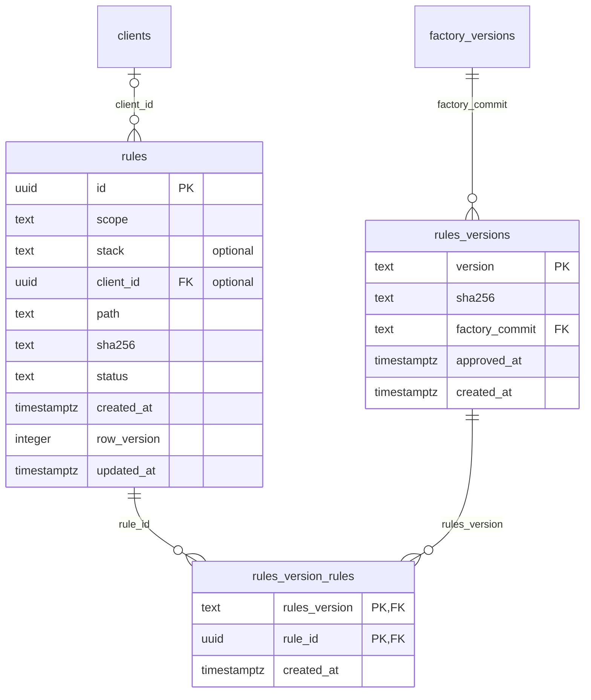
```mermaid
erDiagram
  rules {
    uuid id PK
    text scope
    text stack "optional"
    uuid client_id FK "optional"
    text path
    text sha256
    text status
    timestamptz created_at
    integer row_version
    timestamptz updated_at
  }
  rules_version_rules {
    text rules_version PK, FK
    uuid rule_id PK, FK
    timestamptz created_at
  }
  rules_versions {
    text version PK
    text sha256
    text factory_commit FK
    timestamptz approved_at
    timestamptz created_at
  }
  clients |o--o{ rules : "client_id"
  factory_versions ||--o{ rules_versions : "factory_commit"
  rules ||--o{ rules_version_rules : "rule_id"
  rules_versions ||--o{ rules_version_rules : "rules_version"
```

## knowledge

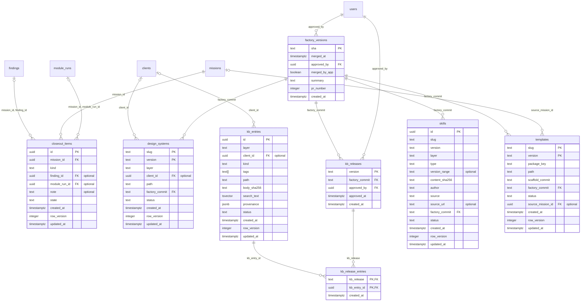
```mermaid
erDiagram
  closeout_items {
    uuid id PK
    uuid mission_id FK
    text kind
    uuid finding_id FK "optional"
    uuid module_run_id FK "optional"
    text note "optional"
    text state
    timestamptz created_at
    integer row_version
    timestamptz updated_at
  }
  design_systems {
    text slug PK
    text version PK
    text layer
    uuid client_id FK "optional"
    text path
    text factory_commit FK
    text status
    timestamptz created_at
    integer row_version
    timestamptz updated_at
  }
  factory_versions {
    text sha PK
    timestamptz merged_at
    uuid approved_by FK
    boolean merged_by_app
    text summary
    integer pr_number
    timestamptz created_at
  }
  kb_entries {
    uuid id PK
    text layer
    uuid client_id FK "optional"
    text kind
    text[] tags
    text path
    text body_sha256
    tsvector search_text
    jsonb provenance
    text status
    timestamptz created_at
    integer row_version
    timestamptz updated_at
  }
  kb_release_entries {
    text kb_release PK, FK
    uuid kb_entry_id PK, FK
    timestamptz created_at
  }
  kb_releases {
    text version PK
    text factory_commit FK
    uuid approved_by FK
    timestamptz approved_at
    timestamptz created_at
  }
  skills {
    uuid id PK
    text slug
    text version
    text layer
    text type
    text version_range "optional"
    text content_sha256
    text author
    text source
    text source_url "optional"
    text factory_commit FK
    text status
    timestamptz created_at
    integer row_version
    timestamptz updated_at
  }
  templates {
    text slug PK
    text version PK
    text package_key
    text path
    text scaffold_commit
    text factory_commit FK
    text status
    uuid source_mission_id FK "optional"
    timestamptz created_at
    integer row_version
    timestamptz updated_at
  }
  clients |o--o{ design_systems : "client_id"
  clients |o--o{ kb_entries : "client_id"
  factory_versions ||--o{ design_systems : "factory_commit"
  factory_versions ||--o{ kb_releases : "factory_commit"
  factory_versions ||--o{ skills : "factory_commit"
  factory_versions ||--o{ templates : "factory_commit"
  findings |o--o{ closeout_items : "mission_id, finding_id"
  kb_entries ||--o{ kb_release_entries : "kb_entry_id"
  kb_releases ||--o{ kb_release_entries : "kb_release"
  missions ||--o{ closeout_items : "mission_id"
  missions |o--o{ templates : "source_mission_id"
  module_runs |o--o{ closeout_items : "mission_id, module_run_id"
  users ||--o{ factory_versions : "approved_by"
  users ||--o{ kb_releases : "approved_by"
```

## evals

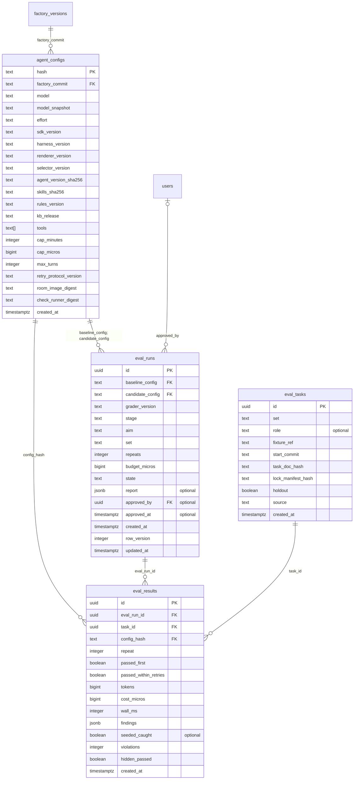
```mermaid
erDiagram
  agent_configs {
    text hash PK
    text factory_commit FK
    text model
    text model_snapshot
    text effort
    text sdk_version
    text harness_version
    text renderer_version
    text selector_version
    text agent_version_sha256
    text skills_sha256
    text rules_version
    text kb_release
    text[] tools
    integer cap_minutes
    bigint cap_micros
    integer max_turns
    text retry_protocol_version
    text room_image_digest
    text check_runner_digest
    timestamptz created_at
  }
  eval_results {
    uuid id PK
    uuid eval_run_id FK
    uuid task_id FK
    text config_hash FK
    integer repeat
    boolean passed_first
    boolean passed_within_retries
    bigint tokens
    bigint cost_micros
    integer wall_ms
    jsonb findings
    boolean seeded_caught "optional"
    integer violations
    boolean hidden_passed
    timestamptz created_at
  }
  eval_runs {
    uuid id PK
    text baseline_config FK
    text candidate_config FK
    text grader_version
    text stage
    text aim
    text set
    integer repeats
    bigint budget_micros
    text state
    jsonb report "optional"
    uuid approved_by FK "optional"
    timestamptz approved_at "optional"
    timestamptz created_at
    integer row_version
    timestamptz updated_at
  }
  eval_tasks {
    uuid id PK
    text set
    text role "optional"
    text fixture_ref
    text start_commit
    text task_doc_hash
    text lock_manifest_hash
    boolean holdout
    text source
    timestamptz created_at
  }
  agent_configs ||--o{ eval_results : "config_hash"
  agent_configs ||--o{ eval_runs : "baseline_config; candidate_config"
  eval_runs ||--o{ eval_results : "eval_run_id"
  eval_tasks ||--o{ eval_results : "task_id"
  factory_versions ||--o{ agent_configs : "factory_commit"
  users |o--o{ eval_runs : "approved_by"
```
